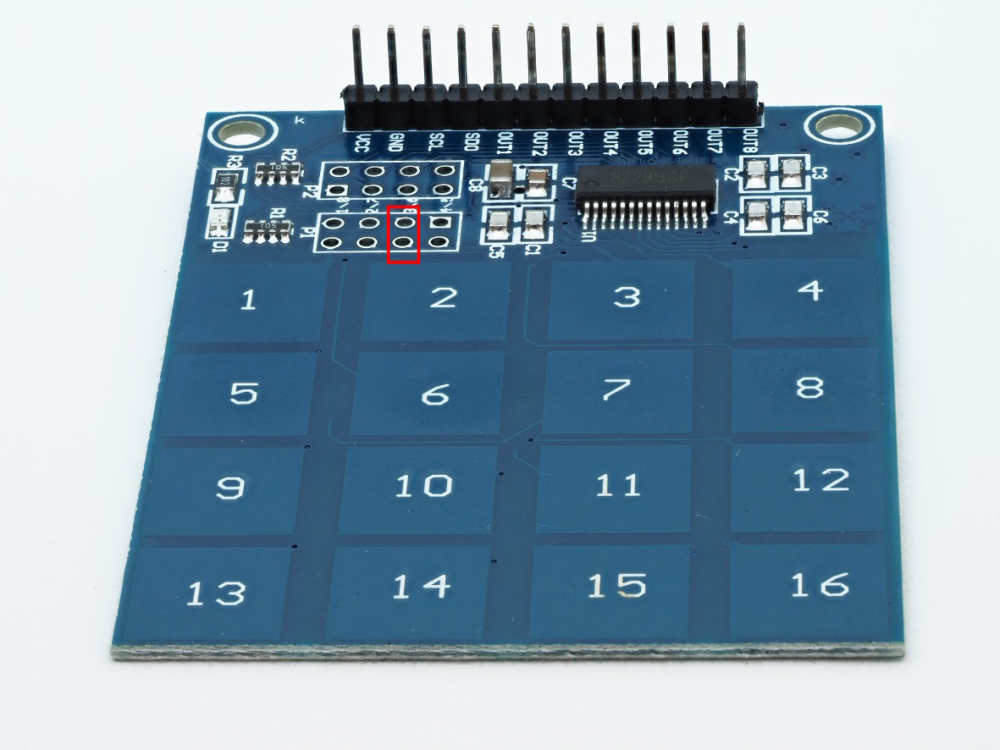

Pi-TTP229-Keypad
================

This litte project provides a systemd-service for reading and processing
keyevents from TTP229-based 16-key keypads:

Note that some of these keypads have an I2C-interface, these are explicitely
not in scope.

From hardware-side you have to add a jumper to the lower jumper-field
to enable all 16 keys. In the above image the relevant holes are marked in
red.

Architecture
============

The systemd-service `ttp229-keypad.service` runs a python-script which
polls the keypad. When a key is detected, the script writes the key-number
to the pipe `/var/run/ttp229-keypad.fifo`. A consumer-program has to
poll this pipe and process the key-events.

Reading the keys from the keypad needs polling and since Raspbian is
not a real-time operating system, this might miss keys, especially under
heavy load. So if this is an issue it is better to attach the keypad
to a dedicated microcontroller and pass the key-events to the Pi
e.g. using a serial line instead.

Installation
============

Download the project-files and install the service with these commands:

    git clone https://github.com/bablokb/pi-ttp229-keypad.git
    cd pi-ttp229-keypad
    sudo tools/install

Note that if you use Raspbian-lite, you might have to install git first.

Configuration
=============

The keypad needs two GPIOs besides VCC and GND: a clock pin `SCL` and a
data-pin `SDO`. Any pin will do fine, the "SCL" has nothing to do with
the standard SCL-pin of the I2C-interface. You have to enter the pins in the
file `/etc/ttp229-keypad.conf`. In this configuration-file you can also
configure some timing-parameters. Change these values in case your
programm has problems reading the keys (e.g. key-misses or repeated keys).

After finishing configuration, start the service with

    sudo systemctl start ttp229-keypad.service

Test
====

You can find a simple test-script in `examples/ttp229-keydump`. Make sure
the keypad is connected and the service is up and running:

    sudo systemctl status ttp229-keypad.service

Then start the test-program (assuming you haven't changed the directory):

    examples/ttp229-keydump

As soon as you touch the keys they should appear in the terminal.
